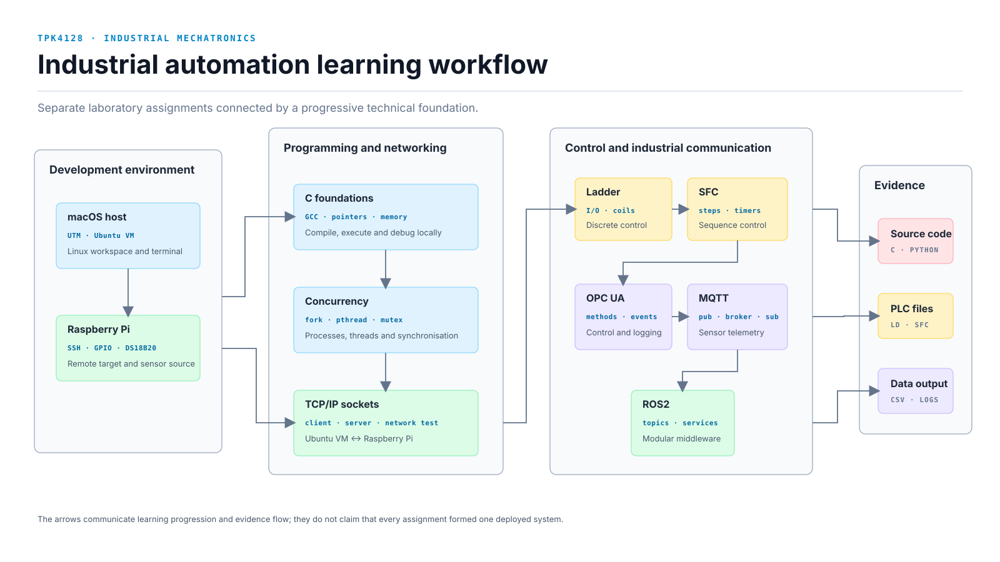

# Industrial Automation and Communication

Coursework portfolio from **TPK4128 – Industrial Mechatronics at NTNU**. The
repository collects the parts of the laboratory assignments that best
demonstrate practical skills in Linux, C, PLC programming and industrial
communication.

The assignments were separate exercises, but the learning progression is
connected: low-level programming provides the foundation, network protocols
move data between devices, PLC languages describe machine behaviour, and
industrial middleware exposes control and telemetry to higher-level software.



## What the coursework covered

| Stage | Laboratory work | Skills demonstrated | Main technologies |
| --- | --- | --- | --- |
| 01 | Development environment and C fundamentals | Linux terminal workflow, compiling, running and debugging C programs | UTM, Ubuntu, GCC, Nano, Bash |
| 02 | Processes, threads and memory | `fork()`, POSIX threads, semaphores, mutexes, race conditions, pointers, dynamic allocation and error handling | C, POSIX, pthreads |
| 03 | TCP/IP socket communication | Client/server design, ports, addressing, socket I/O and communication between two computers | C, TCP/IP, Ubuntu VM, Raspberry Pi |
| 04 | PLC programming | Combinational machine logic, I/O mapping and conveyor control | Ladder Diagram, Beremiz, OpenPLC |
| 05 | Sequential control | Steps, transitions, timers and a repeating production-line sequence | SFC, Beremiz, OpenPLC |
| 06 | OPC UA | Server connection, address-space browsing, method calls, subscriptions and CSV event logging | Python, `asyncua`, OPC UA |
| 07 | MQTT telemetry | Sensor acquisition and publisher/subscriber messaging | Python, Paho MQTT, Mosquitto, Raspberry Pi, DS18B20 |
| 08 | ROS2 communication | Nodes, topics, services, actions, launch files and graph inspection | ROS2, Turtlesim, `rqt_graph`, Python |

## Repository structure

```text
industrial-automation-and-communication/
├── README.md
├── foundations/c/
│   ├── concurrency/
│   └── README.md
├── networking/tcp-ip/
│   ├── client/
│   ├── server/
│   └── README.md
├── plc/
│   ├── ladder/
│   ├── sfc/
│   └── README.md
├── opc-ua/
│   ├── control-client/
│   ├── data-logger/
│   └── README.md
├── messaging/mqtt/
│   ├── publisher/
│   ├── subscriber/
│   └── README.md
├── ros2/
│   └── README.md
├── results/
│   ├── diagrams/
│   └── sample-data/
├── documentation/
└── scripts/
```

The repository primarily uses source files and short technical notes. The PLC
section is the exception: it contains only the original Ladder Diagram and SFC
evidence images submitted for the laboratory work. No generated or modified
PLC project is presented as the submitted solution.

## Environment used in the course

### macOS

The Linux-based assignments were completed in an Ubuntu virtual machine:

```text
macOS host → UTM virtual machine → Ubuntu → GCC / Python / ROS2 tools
```

Communication exercises used SSH and the local network to connect the Ubuntu
VM to a Raspberry Pi. The submitted Ladder Diagram and SFC solutions were
tested during their respective laboratory sessions and are shown using the
original evidence.

### Windows or Linux alternative

- **Windows:** use WSL2 or an Ubuntu VM for the C/Linux exercises. Beremiz,
  OpenPLC Runtime and FTsim can be installed directly where supported.
- **Linux:** run GCC, Python, Mosquitto and ROS2 natively. A Raspberry Pi is only
  required for the physical sensor and cross-device exercises.

## Selected technical work

### Linux and systems programming in C

The early laboratories introduced the Linux development workflow before moving
into processes, threads and shared-state problems. Selected source files show
the difference between process-local memory and thread-shared memory, followed
by mutex-protected access to a critical section.

Key concepts:

- compiling and debugging with GCC;
- processes using `fork()`;
- POSIX threads and shared global state;
- semaphores, mutexes and race conditions;
- pointers, dynamic memory and safe error handling; and
- wall-clock time versus CPU time.

### TCP/IP sockets between Ubuntu and Raspberry Pi

A C client/server pair was first tested locally inside Ubuntu and then across
two computers, with the client running in the VM and the server on a Raspberry
Pi. The exercise covered hostnames, ports, socket connection setup, reading and
writing byte streams, and handling more than one message.

```bash
cd networking/tcp-ip
make
./server/socket_server 5000
./client/socket_client localhost 5000 "Hello World"
```

### PLC logic: Ladder Diagram and SFC

The PLC exercises modelled a small production line with conveyors, milling,
drilling and transfer mechanisms.

- **Ladder Diagram:** Boolean control logic and documented I/O mapping.
- **Sequential Function Chart:** steps, transitions and timers for a repeating
  production-line sequence.

The original submitted schematics and variable tables are stored under
[`plc/`](plc/). Generated Structured Text and modified PLCopen projects are not
included.

### OPC UA control and event logging

Python clients connected to the course OPC UA information model to:

- verify the server connection;
- browse nodes and identifiers;
- invoke start/stop methods for the mill and drill;
- subscribe to photo-sensor state changes; and
- write timestamped events to CSV for travel-time analysis.

The server endpoint is supplied through `OPCUA_URL`, so private network
addresses are not committed to the repository.

### MQTT sensor telemetry

A Raspberry Pi read a DS18B20 temperature sensor and published the values to
the `rpi/temperature` topic. A separate subscriber received the stream through
an MQTT broker, demonstrating the publisher/broker/subscriber model.

### ROS2 fundamentals

The final exercises explored distributed application structure with ROS2:

- publishing and inspecting topics with Turtlesim;
- visualising nodes and connections in `rqt_graph`;
- launching multiple nodes;
- request/response communication through services; and
- longer-running processing through actions.

The full course-provided ROS2 package is not redistributed. The repository
documents the interfaces used and the small controller-condition change made
during the assignment.

## Local checks

Run the repository checks from the root:

```bash
./scripts/verify_local.sh
```

The script compiles the C examples, runs a local socket round-trip,
syntax-checks the Python files, performs an MQTT dry-run and confirms that the
four original PLC evidence images are present.

## Scope and authorship

This repository is a documented portfolio version of my course work. The PLC
schematics and variable tables are original submission evidence. Some C,
TCP/IP and MQTT source files were retyped or reconstructed from my submission
records after the original source archive became incomplete; they are included
to preserve the implementations and concepts I worked with, not presented as
untouched submission files. Lecturer-provided source packages are excluded.
When an assignment used a supplied system, the relevant README identifies my
own task without claiming authorship of the surrounding framework.

This is educational work and not production-ready control software.
