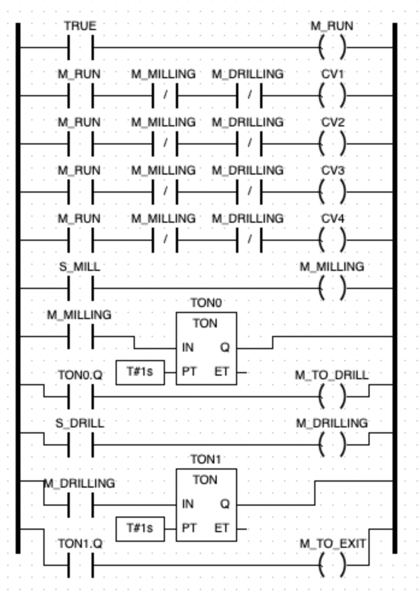
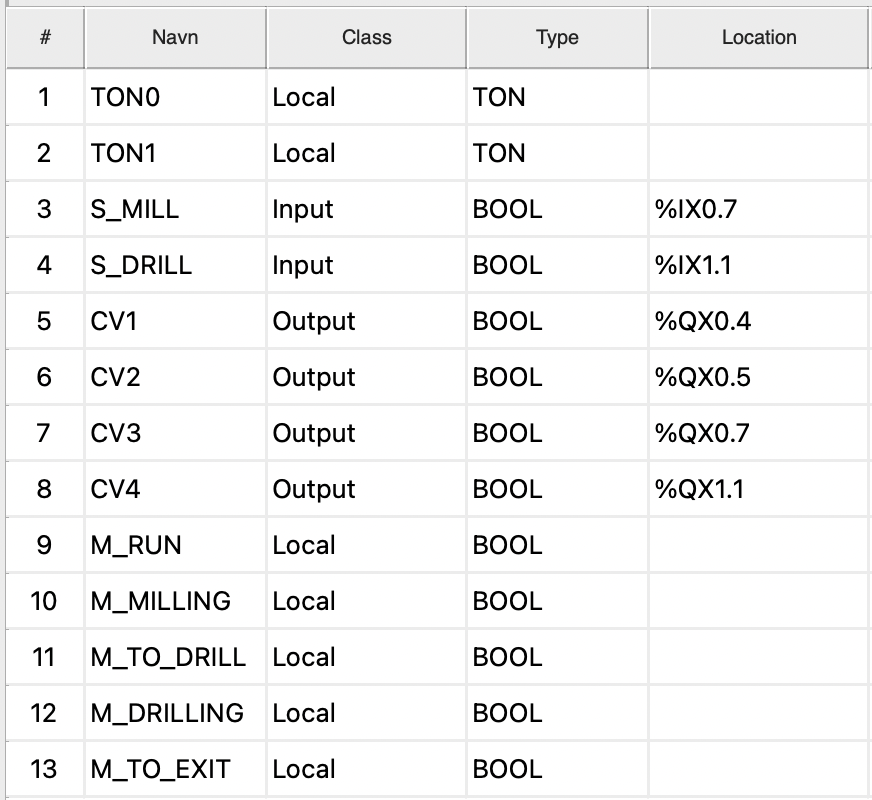

# E8 Ladder Diagram

The Ladder Diagram controlled conveyor motion through milling and drilling
states using sensor inputs, internal state variables and on-delay timers. The
solution was used successfully during the laboratory task.

## Original submission evidence

These are the original images from the submitted work. They have not been
redrawn, repaired or regenerated for this repository.
