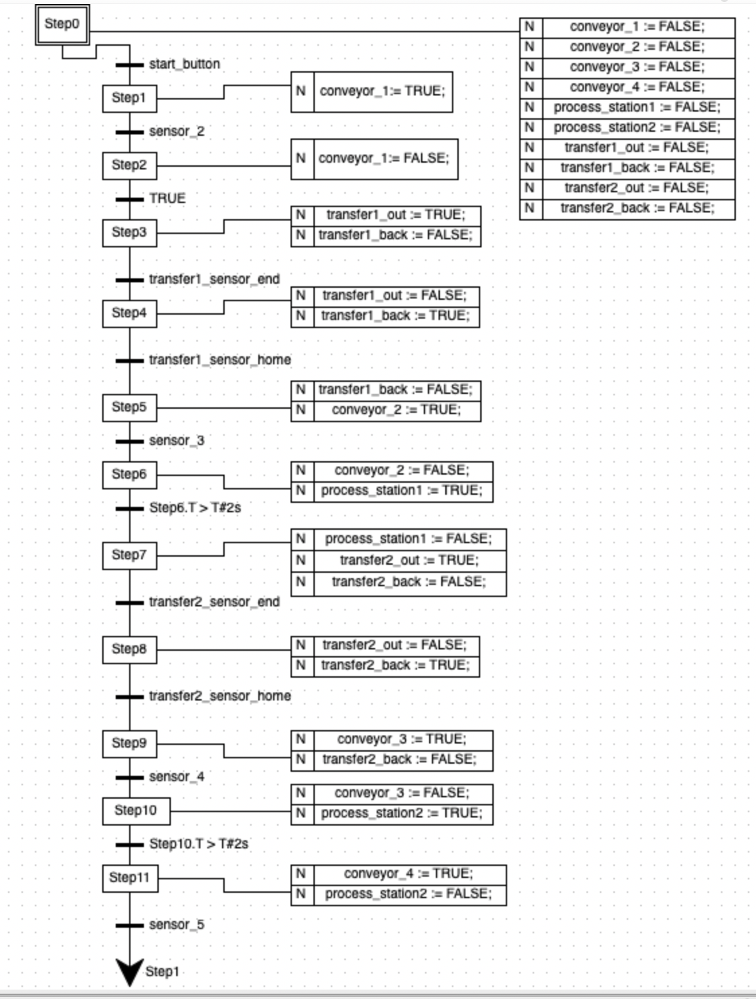
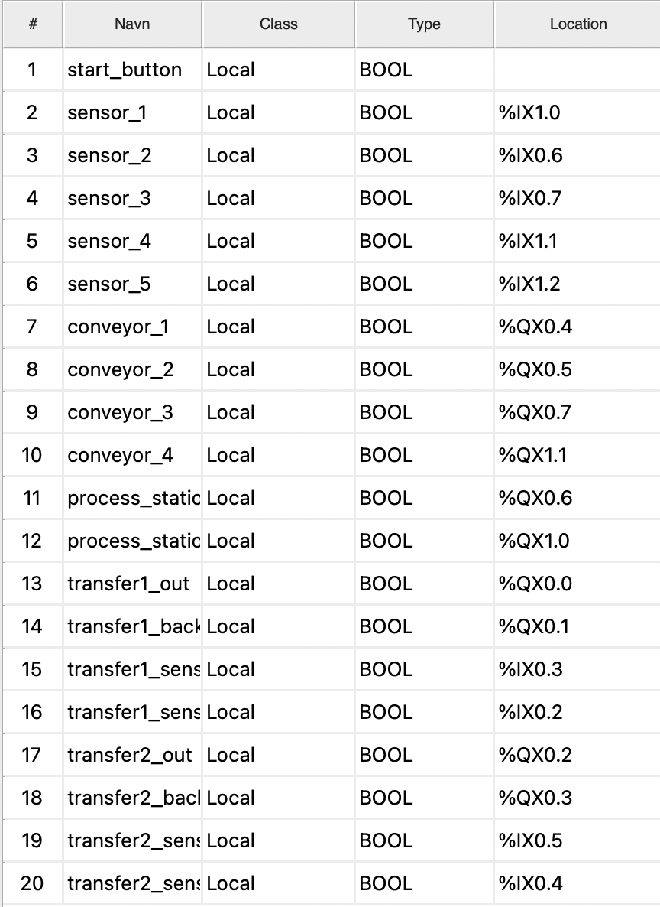

# E9 Sequential Function Chart

The Sequential Function Chart coordinated four conveyors, two transfer
mechanisms and two processing stations through sensor-driven transitions and
timed process steps. The solution was used successfully during the laboratory
task.

## Original submission evidence

These are the original images from the submitted work. They have not been
redrawn, repaired or regenerated for this repository.
